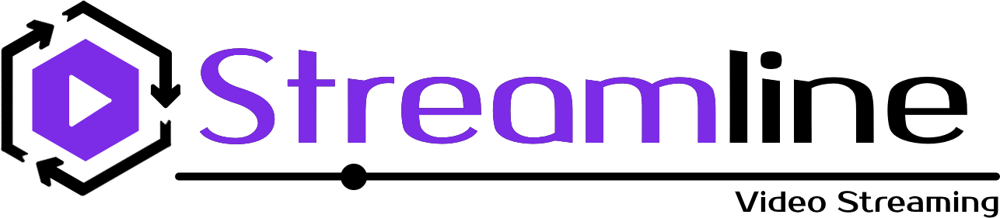

 
 

Captura de Multimedia en Vivo para Streaming Adaptativo

## Características

- 

## Requisitos

- Visual Studio Code v1.35.1

## Instalación

## Utilización

* 

###### Tip:

--------

## Configuraciones

* 

## Acerca de

<h2>Contacto</h2>

Puedes encontrarme en <a href="http://steamcommunity.com/id/rolandostar/">Steam</a> y <a href="https://www.reddit.com/user/rolandostar">Reddit</a>!

Si deseas apoyar este proyecto, donaciones son bienvenidas:

